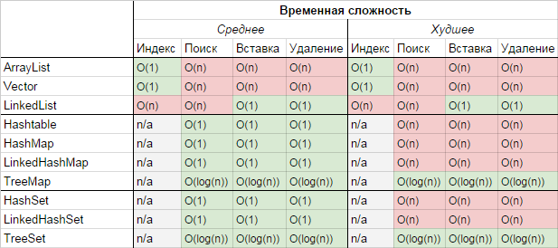

# Collection API
>иерархия интерфейсов и их реализаций, которая является частью JDK и позволяет разработчику пользоваться большим количесвом структур данных из «коробки».

---
---
###`Collection` 
этот интерфейс находится в составе JDK c версии 1.2 и определяет основные методы работы с простыми наборами элементов, которые будут общими для всех его реализаций (например size(), isEmpty(), add(E e) и др.). Интерфейс был слегка доработан с приходом дженериков в Java 1.5. Также, в версии Java 8, было добавлено несколько новых методов для работы с лямбдами (такие как stream(), parallelStream(), removeIf(Predicate<? super E> filter) и др.).
>Важно также отметить, что эти методы были реализованы непосредственно в интерфейсе как `default`-методы.
---
---
###`Map` 
Данный интерфейс также находится в составе JDK c версии 1.2 и предоставляет разработчику базовые методы для работы с данными вида «ключ — значение».Также как и Collection, он был дополнен дженериками в версии Java 1.5 и в версии Java 8 появились дополнительные методы для работы с лямбдами, а также методы, которые зачастую реализовались в логике приложения (getOrDefault(Object key, V defaultValue), putIfAbsent(K key, V value)).

>`Hashtable` — реализация такой структуры данных, как хэш-таблица. Она не позволяет использовать `null` в качестве значения или ключа. Эта коллекция была реализована раньше, чем `Java Collection Framework`, но в последствии была включена в его состав. Как и другие коллекции из Java 1.0, `Hashtable` является __синхронизированной__ (почти все методы помечены как synchronized). Из-за этой особенности у неё имеются существенные проблемы с производительностью и, начиная с Java 1.2, в большинстве случаев рекомендуется использовать другие реализации интерфейса `Map` ввиду отсутствия у них синхронизации.

>`HashMap` — коллекция является альтернативой `Hashtable`. Двумя основными отличиями от `Hashtable` являются то, что `HashMap` __не синхронизирована__ и HashMap позволяет использовать `null` как в качестве ключа, так и значения. Так же как и `Hashtable`, данная коллекция не является упорядоченной: порядок хранения элементов зависит от хэш-функции. Добавление элемента выполняется за константное время O(1), но время удаления, получения зависит от распределения хэш-функции. В идеале является константным, но может быть и линейным O(n).

>`LinkedHashMap` — это __упорядоченная__ реализация хэш-таблицы. Здесь, в отличии от `HashMap`, порядок итерирования равен порядку добавления элементов. Данная особенность достигается благодаря двунаправленным связям между элементами (аналогично `LinkedList`). Но это преимущество имеет также и недостаток — увеличение памяти, которое занимет коллекция.

>`TreeMap` — реализация `Map` основанная на __красно-чёрных деревьях__. Как и `LinkedHashMap` является упорядоченной. По-умолчанию, коллекция сортируется по ключам с использованием принципа `natural ordering`, но это поведение может быть настроено под конкретную задачу при помощи объекта `Comparator`, который указывается в качестве параметра при создании объекта TreeMap.

>`WeakHashMap` — реализация хэш-таблицы, которая организована с использованием `weak references`. Другими словами, `Garbage Collector` автоматически удалит элемент из коллекции при следующей сборке мусора, если на ключ этого элеметна нет __жёстких ссылок__.

---
---
###`List` 

> `Stack` — данная коллекция является расширением коллекции `Vector`. Была добавлена в Java 1.0 как реализация стека `LIFO` (last-in-first-out). Является частично синхронизированной коллекцией (кроме метода добавления `push()`). После добавления в Java 1.6 интерфейса `Deque`, рекомендуется использовать именно реализации этого интерфейса, например `ArrayDeque`.

> `ArrayList` — как и `Vector` является реализацией динамического массива объектов. Позволяет хранить любые данные, включая `null` в качестве элемента. Как можно догадаться из названия, его реализация основана на обычном массиве. Данную реализацию следует применять, если в процессе работы с коллекцией предплагается частое обращение к элементам по индексу. Из-за особенностей реализации поиндексное обращение к элементам выполняется за __константное время O(1)__. Но данную коллекцию рекомендуется избегать, если требуется частое удаление/добавление элементов в середину коллекции.

> `LinkedList` — ещё одна реализация `List`. Позволяет хранить любые данные, включая `null`. Особенностью реализации данной коллекции является то, что в её основе лежит __двунаправленный связный список__ (каждый элемент имеет ссылку на предыдущий и следующий). Благодаря этому, добавление и удаление из середины, доступ по индексу, значению происходит за линейное время O(n), а из начала и конца за константное O(1). Так же, ввиду реализации, данную коллекцию можно использовать как стек или очередь. Для этого в ней реализованы соответствующие методы.

---
---
###`Set`

>`HashSet` — реализация интерфейса `Set`, базирующаяся на `HashMap`. Внутри использует объект `HashMap` для хранения данных. В качестве ключа используется добавляемый элемент, а в качестве значения — объект-пустышка (new Object()). Из-за особенностей реализации порядок элементов не гарантируется при добавлении.

>`LinkedHashSet` — отличается от `HashSet` только тем, что в основе лежит `LinkedHashMap` вместо `HashMap`. Благодаря этому отличию порядок элементов при обходе коллекции является идентичным порядку добавления элементов.

>`TreeSet` — аналогично другим классам-реализациям интерфейса `Set` содержит в себе объект `NavigableMap`, что и обуславливает его поведение. Предоставляет возможность управлять порядком элементов в коллекции при помощи объекта `Comparator`, либо сохраняет элементы с использованием `natural ordering`.

---
---
###`Queue`

>Этот интерфейс описывает коллекции с предопределённым способом вставки и извлечения элементов, а именно — очереди `FIFO` (first-in-first-out). Помимо методов, определённых в интерфейсе Collection, определяет дополнительные методы для извлечения и добавления элементов в очередь.
---
---

---
---
> `natural ordering` -> `Interface Comparable<T>`
