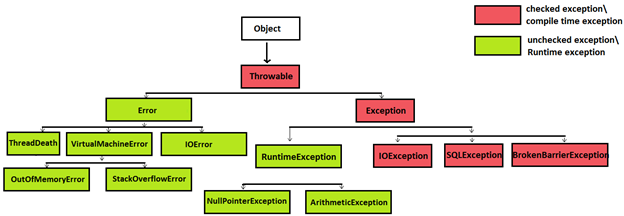

#`Exception`

###В чем особенность блока `finally`? Всегда ли он исполняется?

Когда исключение передано, выполнение метода направляется по нелинейному пути. Это может стать источником проблем. Например, при входе метод открывает файл и закрывает при выходе. Чтобы закрытие файла не было пропущено из-за обработки исключения, был предложен механизм `finally`.

### Что вы знаете об обрабатываемых и не обрабатываемых (`checked`/`unchecked`) исключениях?

`Error` — `checked`

`RuntimeException` и все их наследники — `unchecked`

>`Checked` исключения отличаются от `Unchecked` исключения в Java, тем что:
1)Наличие\обработка `Checked` исключения проверяются на этапе компиляции. Наличие\обработка `Unchecked` исключения происходит на этапе выполнения.

1. `Checked` исключения, это те, которые должны обрабатываться блоком `catch` или описываться в сигнатуре метода. `Unchecked` могут не обрабатываться и не быть описанными.
2. `Unchecked` исключения в Java — наследованные от `RuntimeException`, checked — от `Exception` (не включая `unchecked`).

###Что вы знаете о `SQLException`? К какому типу `checked` или `unchecked` оно относится, почему?
`SQLException` предоставляет информацию об ошибках доступа к базе данных или других ошибках связанных с работой с базами данных.

`SQLException` относится к `checked` исключениям, а значит проверяется на этапе компиляции.

###Что такое `Error`? В каком случае используется `Error`. Приведите пример Error’а.
Ошибки (Errors) представляют собой более серьёзные проблемы, которые, согласно спецификации Java, не следует пытаться обрабатывать в собственной программе, поскольку они связаны с проблемами уровня `JVM`. Например, исключения такого рода возникают, если закончилась память, доступная виртуальной машине.

За примером посмотрите картинку иерархии исключений в начале. Как пример — `OutOfMemoryError`.

>Общее правило — обрабатывать исключения нужно от «младшего» к старшему. Т.е. нельзя поставить в первый блок catch(Exception e) {}, иначе все дальнейшие блоки catch() уже ничего не смогут обработать, т.к. любое исключение будет попадать под ExceptionName extends Exception.